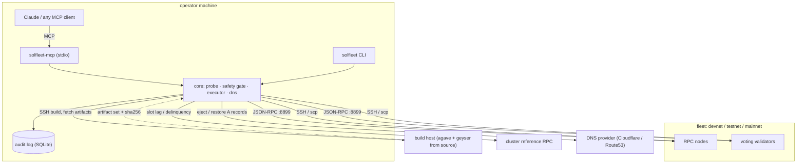
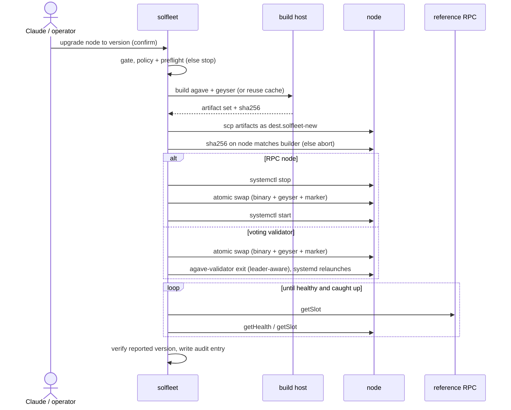
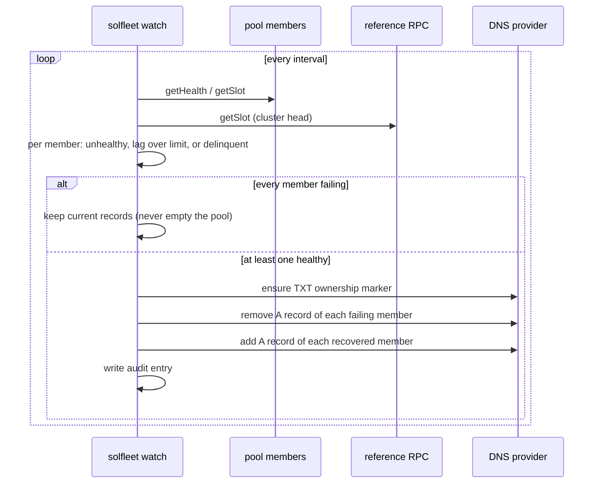

# solfleet

[](https://github.com/sanjeevkkansal/solfleet/actions/workflows/ci.yml)
[](LICENSE)
[](pyproject.toml)

Agent-safe fleet management for independent Solana validators and RPC
nodes. One config file describes your fleet across devnet, testnet, and
mainnet. An MCP server (and a CLI) exposes Solana-aware status, safe
in-place upgrades, and health-driven DNS failover to Claude or any MCP
client. Every operation that changes a node is dry-run by default,
policy-gated, and audited. solfleet never reads or moves your keypairs.

See [PLAN.md](PLAN.md) for the roadmap and design notes.

## Architecture

solfleet runs on the operator's machine (or a small VM). It talks to the
fleet over JSON-RPC (read) and SSH/scp (act), builds artifacts on a
separate build host, computes slot lag against each cluster's reference
RPC, and manages failover records at the DNS provider. Every mutation
flows through one gate and is written to a SQLite audit log.



### How an in-place upgrade runs



### How failover runs



## Why

- **Solana-aware health.** A generic health check sees HTTP 200; a Solana
  node can be 500 slots behind and still return 200. solfleet checks slot
  lag against the cluster, delinquency, and version drift.
- **Build-and-distribute.** Agave v3.0 dropped prebuilt validator
  binaries, so every operator now has to build from source. solfleet
  builds once on a dedicated builder node (with the ABI-matched
  Yellowstone geyser `.so`), caches it, and distributes the artifact set
  to the fleet.
- **Leader-aware restarts.** Restarting a voting validator during its own
  leader slots skips blocks. solfleet restarts validators via a
  leader-aware safe-exit; RPC nodes cycle via systemctl.
- **Safe failover.** The watch loop pulls lagging/unhealthy nodes out of
  DNS and restores them on recovery, and refuses to ever empty a pool.

## Status

v1. Built and unit-tested (91 tests, CI on Python 3.11-3.13). Most paths are
also proven live against a disposable devnet node and a real Cloudflare zone.

Proven live:

- read path: `status`, `validate`, `vote-status`, `inspect`
- `restart` (RPC via systemctl; validator via leader-aware safe-exit)
- in-place `upgrade` end to end (build agave from source on a builder,
  distribute, sha256-verify on the target, atomic swap, catch-up) for both
  RPC and voting-validator nodes
- `bootstrap-builder` (toolchain + deps on a bare builder)
- `provision` a voting validator from bare disks (format NVMe, install,
  render the voting unit, start, catch up, vote)
- DNS driver plus `dns status` / `eject` / `restore` and last-member
  protection, against a live Cloudflare zone

Unit-tested but not yet run live:

- the autonomous `watch` loop (probe -> decide -> act); its decision logic is
  unit-tested and it reuses the now-proven Cloudflare driver
- the Route53 driver (no AWS zone to point at yet)

Not built yet: HTTP transport (MCP is stdio-only today). See PLAN.md (M6).

## Install

```sh
pipx install solfleet            # not yet published; for now:
pipx install git+https://github.com/sanjeevkkansal/solfleet
pipx install 'solfleet[route53]' # if you use Route53 for DNS
```

## Quick start

```sh
cp fleet.example.yaml fleet.yaml     # edit with your nodes
cp policy.example.yaml policy.yaml   # optional; sane defaults if absent
solfleet status                      # probe the fleet
solfleet status --watch              # refreshing live table
solfleet validate                    # structural + live readiness check
solfleet vote-status mn-val-1        # voting health: credits, balance, delinquency, leader
solfleet inspect mn-val-1            # read-only SSH detail for one node
solfleet bootstrap-builder b1        # install build toolchain on a builder; --confirm
solfleet provision rpc-1 4.1.0       # dry-run bring-up plan; --confirm to run
solfleet plan-upgrade mn-val-1 4.1.0 # dry-run upgrade plan
solfleet upgrade mn-val-1 4.1.0      # dry-run; add --confirm to execute
solfleet watch --dry-run             # DNS failover loop, decide-only
```

MCP (Claude Code):

```sh
claude mcp add solfleet -- solfleet-mcp
```

## Example session

Pointed at a small devnet fleet. With no flags, commands are read-only or
dry-run.

Fleet health is Solana-aware, not just an HTTP 200:

```console
$ solfleet status
CLUSTER  NODE   ROLE  HEALTH  VERSION     SLOT LAG  VOTE
devnet   rpc-1  rpc   ok      4.1.0-rc.1  0         -
devnet   rpc-2  rpc   ok      4.1.0-rc.1  0         -
```

An upgrade is dry-run by default. It returns the ordered plan and the gate
decision and changes nothing until you pass `--confirm`:

```console
$ solfleet plan-upgrade rpc-1 4.1.0
{
  "decision": {
    "operation": "upgrade",
    "cluster": "devnet",
    "node": "rpc-1",
    "mode": "dry-run",
    "allowed": true,
    "plan": [
      "on builder 'build-1': build agave 4.1.0 from source",
      "distribute artifact set to rpc-1; checksum-verify each (abort on mismatch)",
      "stop solana-validator, swap, start",
      "swap /usr/local/bin/agave-validator + geyser .so + version marker atomically",
      "wait until healthy + caught up to https://api.devnet.solana.com",
      "verify reported version == 4.1.0; record before/after"
    ],
    "reasons": [
      "dry-run: preflight checks pass; pass confirm=true to execute"
    ]
  },
  "target_version": "4.1.0"
}
```

Over MCP, the same operations are tools (`fleet_status`, `plan_node_upgrade`,
`upgrade`, ...). Claude gets that same plan back and has to pass `confirm=true`
to execute, so an agent cannot mutate a node by accident.

## Tools

Read-only: `fleet_status`, `node_detail`, `version_drift`, `vote_status`,
`leader_schedule`, `validate`, `plan_node_upgrade`, `dns_pool_status`,
`audit_log`.

Gated (dry-run by default; `confirm=true` to execute):
`bootstrap_builder_host`, `provision`, `restart`, `upgrade`,
`dns_pool_eject`, `dns_pool_restore`.

Every mutation is dry-run by default, checked against `policy.yaml`
(allowed versions, disk floor, leader-window minimum), and written to a
SQLite audit log. The watch loop is the one autonomous mutator; it is
bounded by the same audit log and the never-empty-a-pool rule.

## Safety model

- **Dry-run by default.** Mutations return their ordered plan and
  preflight unless called with `confirm=true`.
- **Policy gate.** Per-cluster `policy.yaml`: allowed version globs, disk
  floor, and `require_leader_window_minutes` for validators.
- **Checksum-verified distribution.** Upgrade artifacts are sha256-checked
  on the target against the builder before any swap.
- **No keys, ever.** solfleet does not read, move, or generate
  identity/vote keypairs. Voting-validator identity failover is out of
  scope by design (double-signing risk).
- **Audit log.** Every dry-run and execute is recorded in SQLite.

## Development

```sh
uv venv && uv pip install -e '.[dev]'
uv run pytest
```

## MCP registry

Published to the [MCP Registry](https://registry.modelcontextprotocol.io).

mcp-name: io.github.sanjeevkkansal/solfleet
